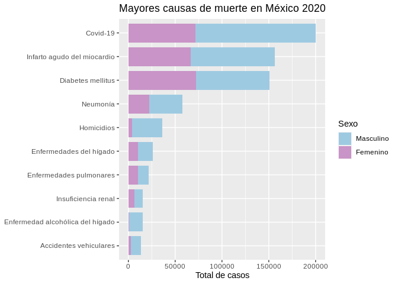

Mortalidad en México 2020
================

Se realizó un análisis de datos relacionados a la mortalidad en México
en el año 2020. Los datos utilizados se pueden encontrar en los
siguientes enlaces:

-   [Mortalidad México
    2020](https://www.inegi.org.mx/programas/mortalidad/#Datos_abiertos)
-   [ITER
    2020](https://www.inegi.org.mx/programas/ccpv/2020/?ps=microdatos)

La lista de causa de muertes utilizada para realizar el análisis fue la
*Lista Mexicana para la Selección de las Principales Causas (LMSPC)*, la
cual permite establecer comparaciones a lo largo del tiempo.

En la siguiente tabla se muestran los resultados obtenidos.

| Grupo | Descripción                                   |  Total |
|:------|:----------------------------------------------|-------:|
| 06T   | NA                                            | 200270 |
| 28A   | Infarto agudo del miocardio                   | 156556 |
| 20D   | Diabetes mellitus                             | 151019 |
| 33B   | Neumonía                                      |  57555 |
| 55    | Agresiones (homicidios)                       |  36773 |
| 35M   | Otras enfermedades del hígado                 |  26174 |
| 33G   | Enfermedades pulmonares obstructivas crónicas |  21949 |
| 38C   | Insuficiencia renal                           |  15455 |
| 35L   | Enfermedad alcohólica del hígado              |  15318 |
| 49B   | Accidentes de tráfico de vehículos de motor   |  13624 |

Se puede observar que la principal causa de muerte se define como un NA,
lo que implica que la *LMSPC* no la contempla. Sin embargo, se puede
observar que pertenece al grupo *06*, el cual hace referencia a
enfermedades víricas, por lo que dado el año en que se presentan los
resultados y el grupo al que pertenece permite hacer una inferencia
sobre la causa de muerte, en este caso tendría sentido inferir que se
trata del COVID-19.

<!-- -->
